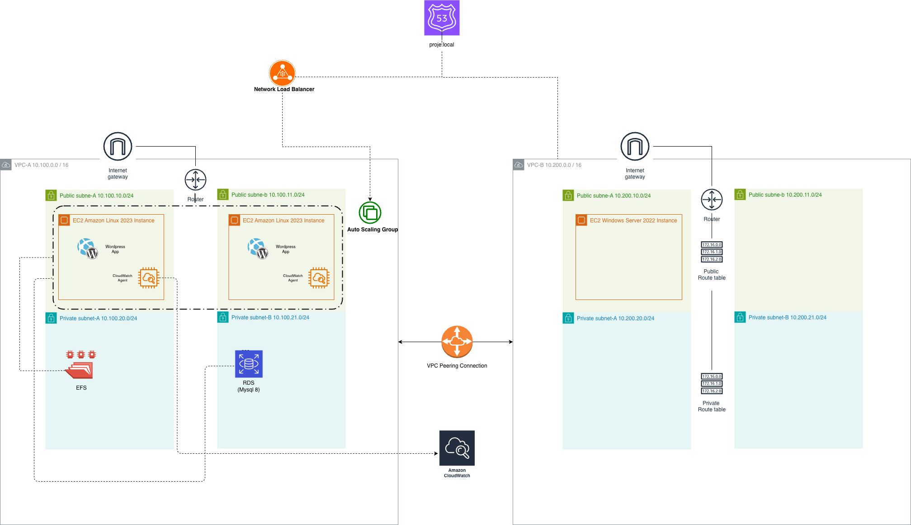
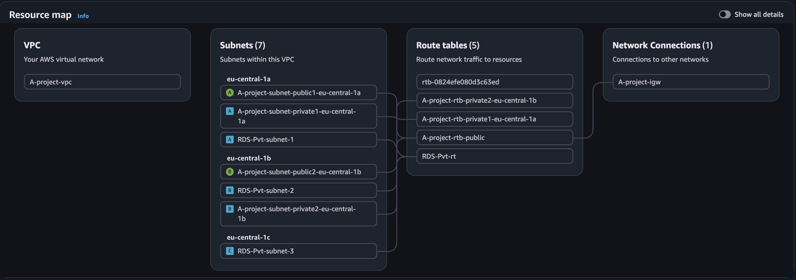
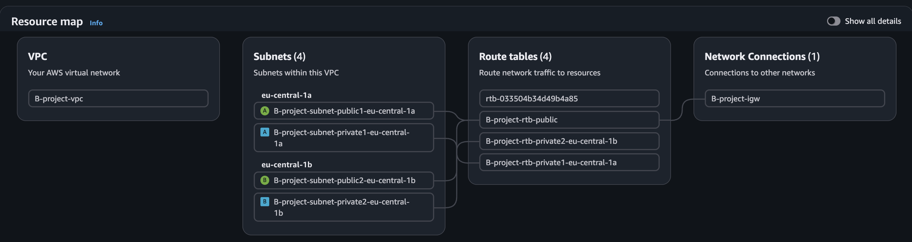
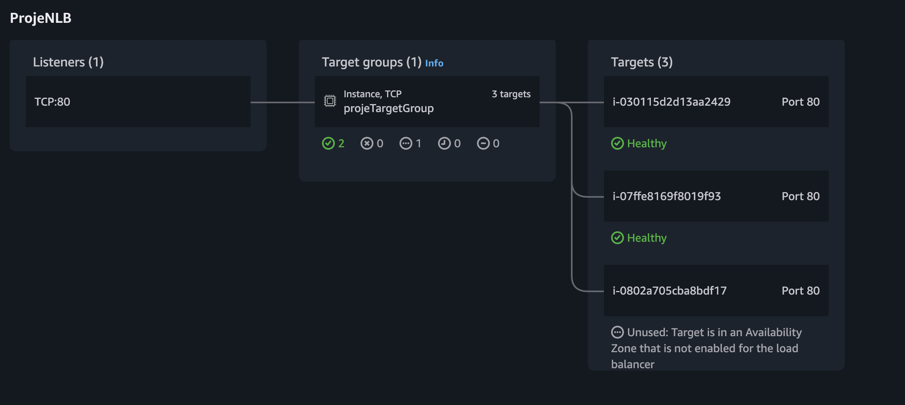
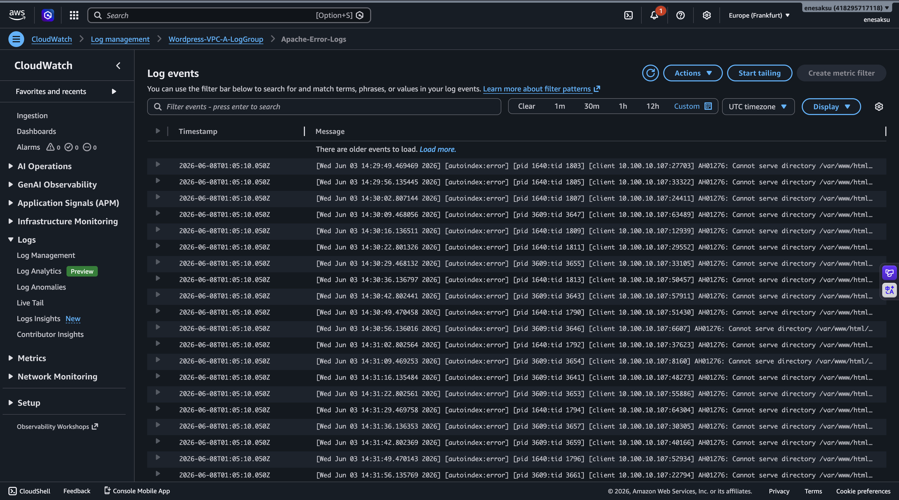
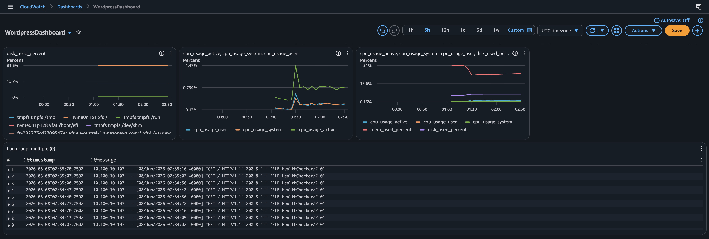
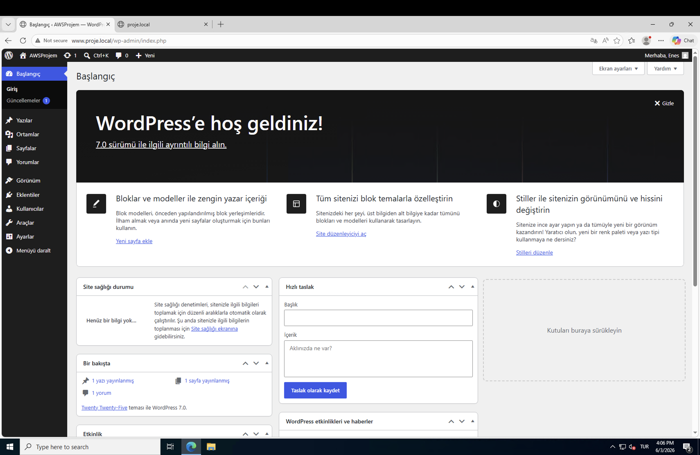

# AWS-HA-WordPress-Infrastructure

Bu proje; AWS üzerinde yüksek erişilebilir (High Available), ölçeklenebilir (Scalable), güvenli ve merkezi olarak izlenebilen (Monitored) kurumsal düzeyde bir WordPress altyapı mimarisidir. Proje kapsamında iki farklı VPC tasarımı yapılmış, bu ağlar birbirine güvenli bir şekilde bağlanmış, yük dengeleme katmanları kurulmuş ve altyapının sağlığı bulut üzerinde metrik ve log seviyesinde anlık olarak takibe alınmıştır.

---

## 🚀 Mimari Özet ve Sonuç

Proje, tek bir sunucunun çökmesi durumunda bile sistemin kesintisiz çalışmaya devam etmesini sağlayan **Multi-AZ (Çoklu Kullanılabilirlik Alanı)** felsefesine dayanır. Trafik dalgalanmalarına göre otomatik genişleyen sunucu grubu, paylaşımlı dosya sistemi ve izole veritabanı katmanıyla production ortamı standartlarındadır.

### Anahtar Başarılar:
* **Sıfır Kesinti (High Availability):** `eu-central-1a` ve `eu-central-1b` izole veri merkezlerinde yedekli yapı.
* **Akıllı Ölçeklendirme:** CPU yükü %50'yi geçtiğinde otomatik devreye giren dinamik `t3.micro` ASG katmanı.
* **Gelişmiş İzleme (CloudWatch Integration):** Sistem metrikleri (CPU, RAM, Disk) ve Apache loglarının anlık analizi.
* **Güvenli Yönetim Katmanı:** Üretim ortamına sadece izole bir yönetim VPC'si (VPC-B) üzerinden güvenli erişim.

---

## 🗺️ Altyapı Mimarisi (Architecture Diagram)

Sistemin tüm bileşenlerini, ağ katmanlarını ve veri akış yönlerini gösteren teknik mimari diyagramı aşağıda yer almaktadır:

---

## 🛠️ Mimari Bileşenler ve Detaylar

### 1. Ağ Tasarımı ve Güvenlik (VPC & Peering)
Proje, görevlerin ayrılması (Separation of Concerns) ilkesine göre iki ayrı VPC mimarisinden oluşur:
* **VPC-A (Production Network - 10.100.0.0/16):** WordPress uygulamasının, yük dengeleyicinin, EFS ve RDS bileşenlerinin barındığı ana üretim ağıdır. Kamu açık (Public) ve dış dünyaya kapalı (Private) alt ağlar (Subnets) içerir.
* **VPC-B (Management Network - 10.200.0.0/16):** Sistem yöneticilerinin altyapıyı güvenli bir şekilde yönetmesi için tasarlanmış izole yönetim katmanıdır. İçerisinde bir Windows Yönetim Sunucusu barındırır.
* **VPC Peering:** VPC-A ve VPC-B ağları, internete çıkış yapmadan AWS omurgası üzerinden **VPC Peering Connection** ile birbirine şifreli ve izole bir şekilde bağlanmıştır. Route Table'lar karşılıklı olarak bu peering bağlantısını hedefleyecek şekilde yapılandırılmıştır.

| Ağ Bileşeni | CIDR Blok | Bölge / AZ | Rolü |
| :--- | :--- | :--- | :--- |
| **VPC-A** | `10.100.0.0/16` | eu-central-1 | Production Altyapısı |
| Public Subnet A | `10.100.10.0/24` | eu-central-1a | Web Sunucu 1 / NLB |
| Public Subnet B | `10.100.11.0/24` | eu-central-1b | Web Sunucu 2 / NLB |
| Private Subnet A | `10.100.20.0/24` | eu-central-1a | RDS / EFS Depolama |
| Private Subnet B | `10.100.21.0/24` | eu-central-1b | RDS / EFS Depolama |
| **VPC-B** | `10.200.0.0/16` | eu-central-1 | Management Katmanı |

### 2. Yük Dengeleme ve Otomatik Ölçeklendirme (NLB & ASG)
* **Network Load Balancer (NLB):** Yüksek performans ve düşük gecikme süresi için katman 4 seviyesinde çalışan bir NLB konumlandırılmıştır. `proje.local` (Route 53) üzerinden gelen HTTP isteklerini karşılayarak arkasındaki Target Group'a (Hedef Grubu) yönlendirir.
* **Auto Scaling Group (ASG):** Üretim ortamında maliyet-performans dengesini korumak için Free Tier uyumlu sunucularla dinamik bir grup tasarlanmıştır.
  * **Kapasite Sınırları:** Desired: 2, Minimum: 2, Maximum: 4.
  * **Ölçeklendirme Politikası (Target Tracking):** Grubun ortalama CPU kullanımı **%50** barajını aştığında otomatik olarak yeni yedek sunucular ayağa kaldırılır; yük bittiğinde sunucular imha edilir.
  * **Health Checks:** Sistem sağlığı sadece EC2 seviyesinde değil, ELB (Elastic Load Balancing) HTTP durum kodları üzerinden denetlenir. Yanıt vermeyen sunucu self-healing mekanizmasıyla otomatik yenilenir.

### 3. Veri ve Kalıcılık Katmanı (EFS & RDS)
* **Amazon EFS (Elastic File System):** Auto Scaling Grubu altındaki tüm bağımsız WordPress sunucularının aynı kaynak dosyalarını (wp-content, görseller, eklentiler) gerçek zamanlı okuyup yazabilmesi için Multi-AZ destekli ortak bir EFS kurulmuştur. Sunucuların `fstab` dosyalarına EFS mount kuralları işlenmiştir.
* **Amazon RDS (Relational Database Service):** WordPress veritabanı, dış dünyadan tamamen izole edilmiş `Private Subnet` katmanında yapılandırılmıştır. Yalnızca web sunucularından gelen `3306` (MySQL) trafiğine izin veren katı Security Group kuralları ile korunmaktadır.

### 4. Merkezi İzleme ve Log Yönetimi (Amazon CloudWatch)
Altyapının gözlemlenebilirliği (Observability) için tüm sunuculara **Amazon CloudWatch Agent** entegre edilmiştir.
* **Sistem Metrikleri:** Varsayılan EC2 metriklerine ek olarak, ajanın yerel mekanizmaları üzerinden RAM kullanımı, CPU detayları (`usage_active`, `usage_user`) ve Disk doluluk oranları anlık olarak toplanır.
* **Merkezi Loglama:** Apache web sunucusunun ürettiği Erişim (`/var/log/httpd/access_log`) ve Hata (`/var/log/httpd/error_log`) logları, sunucular üzerinde birikmeden gerçek zamanlı olarak CloudWatch Logs altında toplanır. Logların AWS üzerinde birikerek maliyet oluşturmaması için saklama süresi (Retention Period) **7 gün** olarak sınırlandırılmıştır.

---

## 💻 Uygulama Doğrulama (Uptime & Live Site)

Sistem tam operasyonel hale getirildiğinde, VPC-B içerisindeki Windows Yönetim makinesi üzerinden yapılan testlerde, Load Balancer (NLB) DNS adresi veya Route 53 kaydı kullanılarak WordPress ana sayfasına kesintisiz ve yüksek performanslı erişim sağlandığı doğrulanmıştır. Sunuculardan biri simüle edilerek kapatıldığında bile web sitesi erişilebilirliğini korumuştur.

